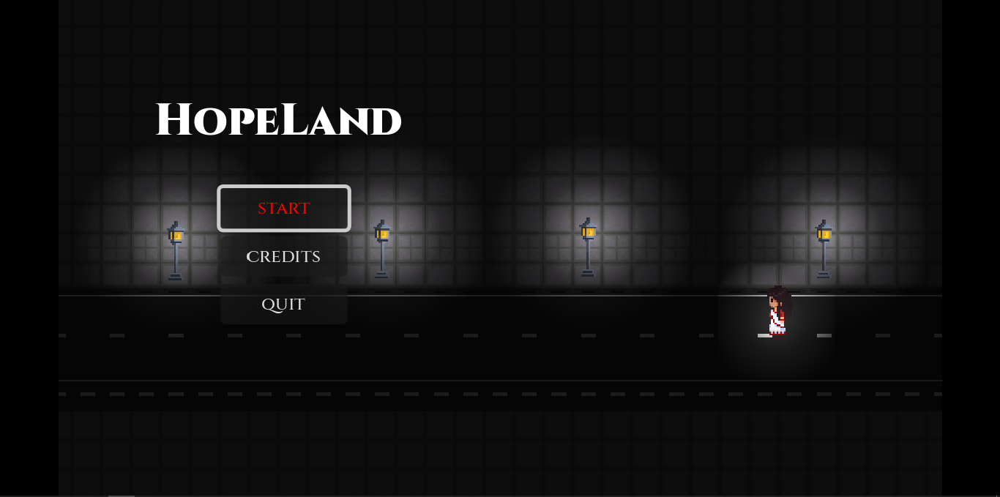
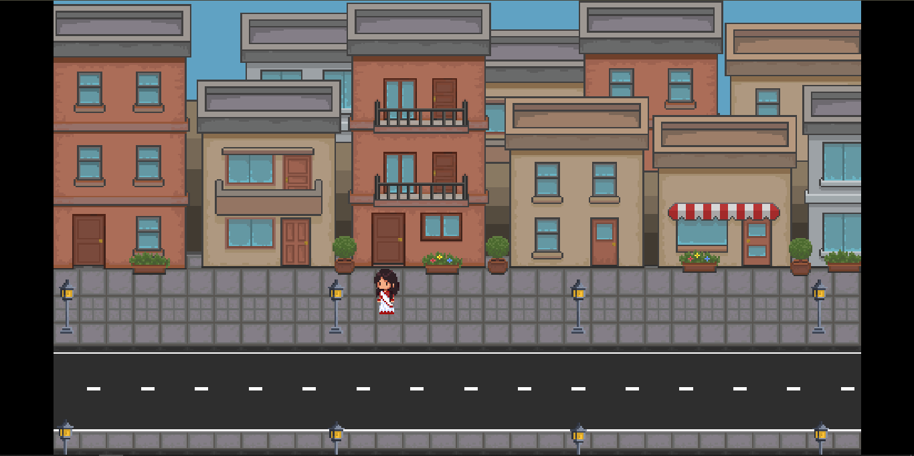
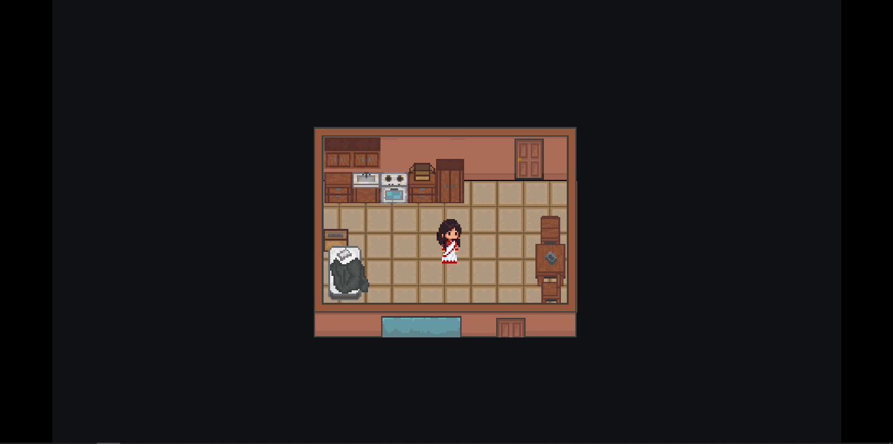
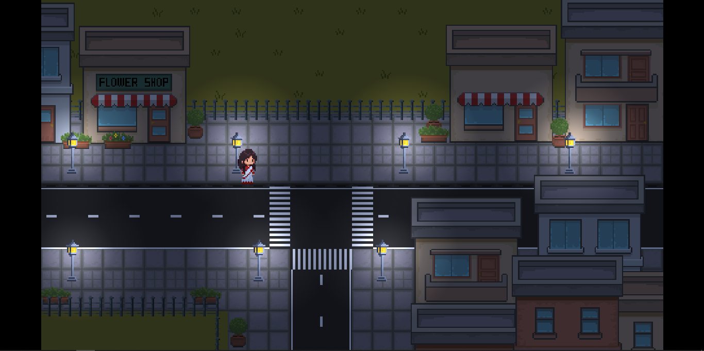
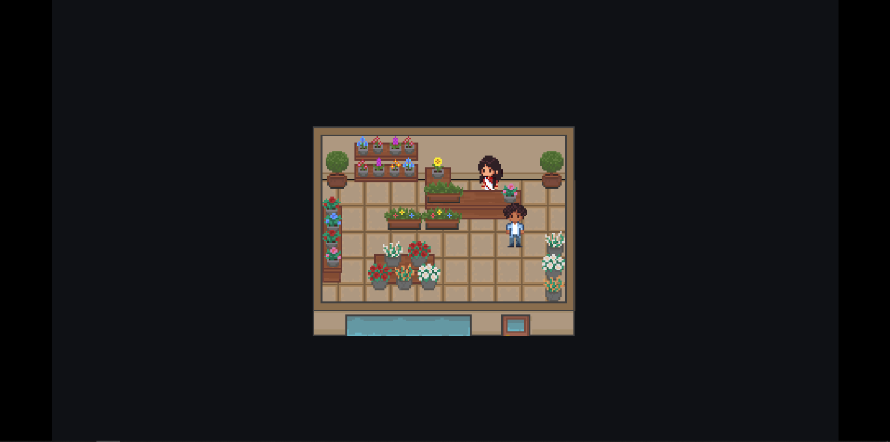

# HopeLand
HopeLand is a short story game that follows the life of a young girl who moved to a small town to start a life far away from her dark past. while everything seemed to be getting better something forced her to return to her dark past.

The short story is suppose to have 2 chatper with 5 or more acts in each chapter.But due to my college starting in a week and me moving to new city im unable to finish a full chapter. So only act 1 of chapter 1 is done!

# Controls

W A S D / UP DOWN LEFT RIGHT arrows to move
Enter to select/interact (doors, npc ,furniture)
ESC to go back to main menu from credit scene


(due to godots default setting space might trigger some funtion but its not the primary control)

# Pictures from the game!






# Feature
* the game includes fully furnished scenes
* Has multiple area wiht sub areas
* Has a day and night system
* has a modular dialouge system!
* the npc vabe subtle animations
* has a unique story!
# How to install
clone the repo
```bash 
git clone https://github.com/bsastudio601/hope-land.git```

Open the project using Godot 4.7 !
After opening press F5 or click the play button


# Why?
After making 2 arcade like simple game in godot i wanted to try somthing hard but short, an indie game. So i decided to come up with a character design.
then i made a story around the character and gave the story to my friend for reviewing. after we were happy with the stroy we just decided to send it.
but not so surprisingly it took me more than 50 hours to finsih a short portion of the game. the project file even got courropted once.

# Updates
As of now the game has only one act which talkes less than 5 min to complete. act 1 took me so long because i had to made every assets from scratch and the dialouge system.
The dialouge is also written by my with some help from my friend who reviewd and fixed part of dialogue.
## Update 1
* Next i plan to add 2 new chacter for act2 
* Making the park explorable.
* making the cafe and grocery shop furnished.
* add music made by my friends

# How i made it.
The game is made in godot 4.7 with godot script it is my my time making a proper game in godot so it was challenging. I of couse needed to take help from gpt for coding. there were a lot of bugs so i explaind to gpt about the problem and it explained me back.making th cutscene was the hard part. 
I also watched a varity of tutorial from youtube. the spawn point system i leart from a blog post. It was not fully copy pasted i understand my code.
Next i used LibreSprite to make the art. many of the character is based on my friedns. I used gemini to convert my friends picture to a pixel art style. thoug it was not 32x32 so i had to redraw them in my style to make the character look good. I also used gemini to generate a few mocup of the map adn buildign design.
I also used the Dialouge Manager to manage the dialouges. The story is written my ME and my FRIEND.

# conclusion
This was a great learing experience for me abotu game dev and it has made me respect indie game dev even more after seeing how time consuming it is. Specially after the time my project file got courropted. 

Well hope you like it and follow me for the full game in future soon!
